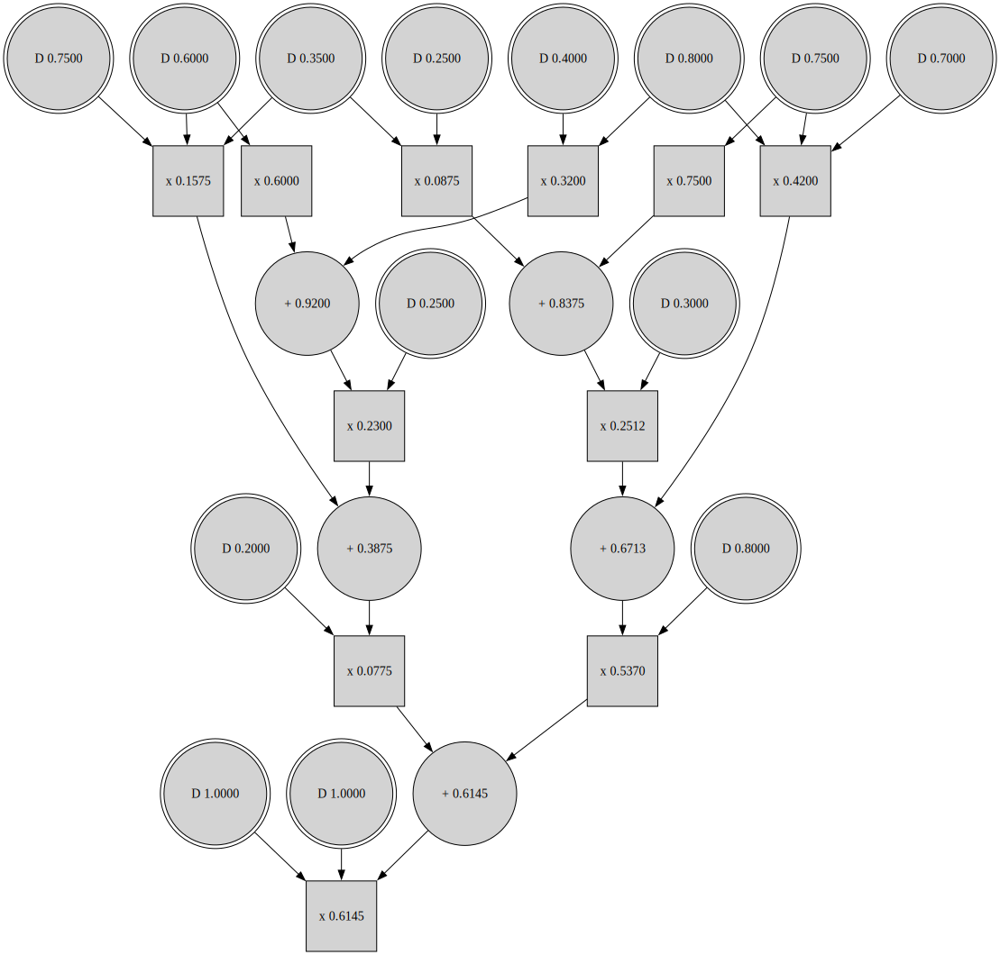

# Schlandals as Compiler

It is also possible to run the solver as a compiler.
That is, running a search based solver, but keeping in memory the trace of the algorithm.
This is mainly used for learning distributions' parameters as there is an overhead of keeping the trace.
As an example, let use the Bayesian Network from [the encoding page](../modelization/bn.md), which encoding is shown below (assuming it is saved in a file name `bn.cnf`)

```
p cnf 26 19
c p distribution 0.2 0.8
c p distribution 0.6 0.4
c p distribution 0.3 0.7
c p distribution 0.25 0.75
c p distribution 0.75 0.25
c p distribution 1.0 0.0
c p distribution 0.35 0.65
c p distribution 0.8 0.2
c p distribution 0.0 1.0
-1 19 0
-2 20 0
-3 -19 21 0
-4 -19 22 0
-5 -20 21 0
-6 -20 22 0
-7 -19 23 0
-8 -19 24 0
-9 -20 23 0
-10 -20 24 0
-11 -21 -23 25 0
-12 -21 -23 26 0
-13 -21 -24 25 0
-14 -21 -24 26 0
-15 -22 -23 25 0
-16 -22 -23 26 0
-17 -22 -24 25 0
-18 -22 -24 26 0
-26 0
```

## Compiling

To run a compilation and evaluate the given arithmetic circuit, use the following command (which only output the probability).
```
schlandals compile -i bn.cnf
```

## Visualizing the Arithmetic Circuit

It is possible to dump the computed arithmetic circuit into a DOT file. Then it can be visualized using DOT (either by running `dot` locally or [online](https://dreampuf.github.io/GraphvizOnline/)).
```bash
schlandals compile -i bn.cnf --dotfile bn.dot
dot -T svg -o ac.dot bn.dot
```

The produced arithmetic circuit is shown below


## Storing the Arithmetic Circuit for Reuse

Schlandals also provide a way to store the circuits in a standardized format so that it can be reuse without recompiling the input problem.

```bash
schlandals compile -i bn.cnf --fdac bn.fdac
```

The command above writes the following content in `bn.fdac`
```
outputs 29 29 26 22 15 14 16 16 19 14 14 18 27 23 17 19 18 19 25 21 21 20 20 24 23 22 25 24 27 26 28 28 29
inputs 7 4 8 4 5 6 11 12 8 13 11 6 17 18 15 16 3 21 10 20 23 19 22 14 2 25 9 24 26 27 0 1 28
d 8 1 0 1 0 0
d 5 0 1 1 0 0
d 0 0 2 1 0 0
d 3 0 3 1 0 0
d 1 0 4 2 0 0
d 1 1 6 1 0 0
d 7 0 7 2 0 0
d 3 1 9 1 0 0
d 6 0 10 2 0 0
d 0 1 12 1 0 0
d 2 0 13 1 0 0
d 4 0 14 2 0 0
d 4 1 16 1 0 0
d 2 1 17 1 0 0
x 18 1 0 3
x 19 1 3 1
x 20 1 4 2
x 21 1 6 1
x 22 1 7 2
x 23 1 9 3
+ 24 1 12 2
+ 25 1 14 2
x 26 1 16 2
x 27 1 18 2
+ 28 1 20 2
+ 29 1 22 2
x 30 1 24 2
x 31 1 26 2
+ 32 1 28 2
x 33 0 30 3
```
The first two lines are vectors that store the input/output relationships of the nodes.
Then, there is one line per node.
    - If the line starts with `d`, it is a distribution node. It sends the value of a distribution to its output. The next two integers are the distribution id and the id of the sent value. For example, the first node is associated with distribution `8` and sends its second value (index starts at 0). The remaining four integers represent the slice (start index + size) in the output (first two) and input (last two) vectors.
    - If the line start with a `+`, it is a sum node. The four integers are slice indicators in the output/input vectors.
    - If the line starts with a `x`, it is a product node. The four integers are slice indicators in the output/input vectors.

## Command Line Arguments

```[schlandals@schlandalspc] schlandals compile --help
Use the DPLL-search structure to produce an arithmetic circuit for the problem

Usage: schlandals compile [OPTIONS] --input <INPUT>

Options:
  -i, --input <INPUT>
          The input file

  -b, --branching <BRANCHING>
          How to branch
          
          [default: min-in-degree]

          Possible values:
          - min-in-degree:  Minimum In-degree of a clause in the implication-graph
          - min-out-degree: Minimum Out-degree of a clause in the implication-graph
          - max-degree:     Maximum degree of a clause in the implication-graph
          - vsids:          Variable State Independent Decaying Sum

      --fdac <FDAC>
          If present, store a textual representation of the compiled circuit

      --dotfile <DOTFILE>
          If present, store a DOT representation of the compiled circuit

  -e, --epsilon <EPSILON>
          Epsilon, the quality of the approximation (must be between greater or equal to 0). If 0 or absent, performs exact search

  -h, --help
          Print help (see a summary with '-h')
```
