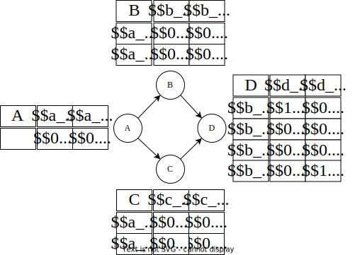

# Modelizing Bayesian Networks

Let \\( B \\) be a Bayesian Network over variables \\( \mathcal{V} = \{V_1, \ldots, V_n\} \\).
As of now, Schlandals can handle queries of the type \\( P(V_i = v) \\) (for any \\( v \\) of \\( V_i \\)'s domain)).
Notice that by rewriting queries of the type \\( P(V_i = v \mid E = e) \\) as the quotient of two marginal probabilities, Schlandals can also solve conditional probability queries.
As an example, below is a Bayesian network with four variables.



Notice that our encoding is very similar to WMC encodings. For more informations about the WMC encodings used in our experiments, see [1,2]

## The Variables

As explained in [here](./language.md), we need two types of variables: probabilistic and deterministic.
Probabilistic variables are denoted \\( \theta \\) and use the following terminology.
The variable \\( \theta_v^{u_1, \ldots, u_p} \\) is used for the CPT entry of node \\( V \\) associated with value \\( v \\) and parents' value \\(u_1, \ldots, u_p \\).
In the example above, there are two probabilistic variables for node \\( A \\), \\( \theta_{a_0}, \theta_{a_1} \\). On the other hand, node B has four probabilistic variables \\( \theta_{b_0}^{a_0},\theta_{b_1}^{a_0}, \theta_{b_0}^{a_1}, \theta_{b_1}^{a_1} \\).
Moreover, the partitioning in distribution follows the structure of the Bayesian Networks; every line in a given CPT constitutes a distribution.
In the example, we have \\( D_1 = {\theta_{a_0}, \theta_{a_1} }, D_2 = \{\theta_{b_0}^{a_0}, \theta_{b_1}^{a_0}\}, D_3 = \{\theta_{b_0}^{a_1}, \theta_{b_1}^{a_1}\}, \ldots \\).
Finally, we have one deterministic variables \\( \lambda_v \\) for each value \\( v \\) of node \\( V \\).

The intuition is that the variables \\( \lambda_v \\) represent whether or not node \\( V \\) takes that particular value.
On the other hand, the \\( \theta_{v}^{p_1, \ldots, p_n\} \\) variables are used to give the correct weight to the interpretations.

## The Clauses

While similar in WMC encodings, the clauses contain one significant difference.
For each CPT entry of node \\( v \\), associated with value \\( v \\) and parents value \\( p_1, \ldots, p_n \\), we have the clause
\\[ \lambda_{p_1} \land \ldots \land \lambda_{p_n} \land \theta_{v}^{p_1, \ldots, p_n} \implies \lambda_{v} \\]

## The Query

Let \\( V \\) have domain \\( v_1, \ldots, v_m \\). Then, to encode the query \\( P(V = v_i \\), we add the clauses \\( \lnot v_i \\) for all \\( i \neq j \\).

## Example

The encoding (in DIMACS-style format) is show below for the query \\( P(D = d_0) \\).
Notice that the probailistic variables start at 1 and are in contiguous blocks.
The 

```bash
p cnf 26 19
c Probabilistic variables 1 2
c p distribution 0.2 0.8
c Probabilistic variables 3 4
c p distribution 0.6 0.4
c Probabilistic variables 5 6
c p distribution 0.3 0.7
c Probabilistic variables 7 8
c p distribution 0.25 0.75
c Probabilistic variables 9 10
c p distribution 0.75 0.25
c Probabilistic variables 11 12
c p distribution 1.0 0.0
c Probabilistic variables 13 14
c p distribution 0.35 0.65
c Probabilistic variables 15 16
c p distribution 0.8 0.2
c Probabilistic variables 17 18
c p distribution 0.0 1.0
c CPT for A. Variable for a_0 = 19, a_1 = 20
-1 19 0
-2 20 0
c CPT for B. Variable for b_0 = 21, b_1 = 22
-3 -19 21 0
-4 -19 22 0
-5 -20 21 0
-6 -20 22 0
c CPT for C. Variable for c_0 = 23, c_1 = 24
-7 -19 23 0
-8 -19 24 0
-9 -20 23 0
-10 -20 24 0
c CPT for D. Variable for d_0 = 25, d_1 = 26
-11 -21 -23 25 0
-12 -21 -23 26 0
-13 -21 -24 25 0
-14 -21 -24 26 0
-15 -22 -23 25 0
-16 -22 -23 26 0
-17 -22 -24 25 0
-18 -22 -24 26 0
c Query
-26 0
```

## References

[1] Mark Chavira and Adnan Darwiche. On probabilistic inference by weighted model counting. Artificial Intelligence, 172(6-7), 2008.
[2] Anicet Bart, Frédéric Koriche, Jean-Marie Lagniez, and Pierre Marquis. An improved CNF encoding scheme for probabilistic inference. In Proceedings of the Twenty-second European Conference on Artificial Intelligence, 2016.
