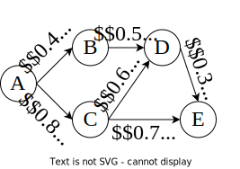

# Dimacs file format

Note that our encoding is the same as the one presented in [1], but with the explicit use of the distributions.
As an example, let us consider the following graph



### Header

The header is a single line in the format

```
p cnf <number variables> <number clauses>
```

### The distributions

One distribution is defined for each edge, representing the fact that it is present or not.

```
c p distribution 0.4 0.6
c p distribution 0.8 0.2
c p distribution 0.5 0.5
...
```

Notice that the lines starts with `c` but are not comments.
Moreover, the variables associated with the distributions are not explicitly declared; they are assigned in order.
That is, the first distribution (edge from A to B) is composed of variable 1 and 2 (variables in DIMACS format starts at 1), distribution for the edge from A to C is composed of variables 3 and 4, etc.

### Deterministic variables

The remaining variables (i.e., `number variables` minus the number of variables used for the distributions) are deterministic variables (without a weight).
There is one variable for each variable in the graph.
For example, 12 variables are needed to encode the distributions, hence variable 13 will be \\( A \\), variable 14 \\( B \\), etc.
On total there are 12 + 5 = 17 variables. As of now, our file looks like

```
p cnf 17 <number clauses>
c p distribution 0.4 0.6
c p distribution 0.8 0.2
c p distribution 0.5 0.5
c p distribution 0.6 0.4
c p distribution 0.7 0.3
c p distribution 0.3 0.7
```


### The Clauses

The clauses encode the connectivity in the graph, using its transitivity property. Each deterministic variable can be seen as an indicator
that tells if the node is reachable from the source node or not.
Intuitively, a node is reachable from the source if it is connected to a node that is reachable from the source.
For example, for node B this translates as "if A is reachable from the source, and the edge from A to B is present, then B is reachable from the source".
Using the variables defined above, we obtain the following clauss \\( 13 \land 1 \Rightarrow 14 \Leftrightarrow \lnot 13 \lor \lnot 1 \lor 14 \\).
The file now looks like

```
p cnf 17 <number clauses>
c p distribution 0.4 0.6
c p distribution 0.8 0.2
c p distribution 0.5 0.5
c p distribution 0.6 0.4
c p distribution 0.7 0.3
c p distribution 0.3 0.7
-13 -1 14 0
-13 -3 15 0
-14 -5 16 0
-15 -7 16 0
-15 -9 17 0
-16 -11 17 0
```

### The evidences

The evidences for such problem encode the source (\\( s \\)) and target (\\( t \\)) node.
Since the goal is to compute the probability that they are not connected, we add the two clauses \\( s \\) and \\( \lnot t \\).
In the example, if the goal is to compute the probability that A and D are connected, then the file is

```
p cnf 17 <number clauses>
c p distribution 0.4 0.6
c p distribution 0.8 0.2
c p distribution 0.5 0.5
c p distribution 0.6 0.4
c p distribution 0.7 0.3
c p distribution 0.3 0.7
-13 -1 14 0
-13 -3 15 0
-14 -5 16 0
-15 -7 16 0
-15 -9 17 0
-16 -11 17 0
13 0
-17 0
```

## References

[1] Leonardo Duenas-Osorio, Kuldeep Meel, Roger Paredes, and Moshe Vardi. Counting-based reliability estimation for power-transmission grids. In Proceedings of the AAAI Conference on Artificial Intelligence, 2017.
